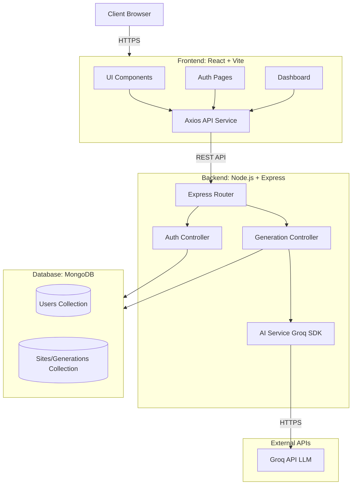

# Fluxyn — AI-Powered Website Builder

Fluxyn is a high-performance, cinematic AI website builder designed to transform natural language descriptions into production-ready React code. Built with a focus on premium aesthetics, Fluxyn utilizes a monochrome design system, liquid-glass effects, and fluid animations to provide a state-of-the-art creation experience.

## 🚀 Features

- **AI-Driven Generation**: Powered by Groq API for ultra-fast generation of full-stack frontend code from simple prompts.
- **Cinematic UI**: Full-page video backgrounds, scroll-driven word reveals, and liquid-glass components.
- **Monochrome Design System**: A clean, professional dark-mode aesthetic using HSL-based design tokens.
- **Project Dashboard & Authentication**: Secure user login, dedicated workspace to manage generations, and template exploration.
- **Real-time Preview**: Integrated iframe-based preview for instant visualization of AI-generated websites.

---

## 🏗️ System Architecture



---

## 📂 Project Structure

```text
Fluxyn/
├── backend/
│   ├── src/
│   │   ├── config/        # Database and environment configurations
│   │   ├── controllers/   # Logic for Auth and AI generation
│   │   ├── middleware/    # Express middlewares
│   │   ├── models/        # Mongoose database models
│   │   ├── routes/        # API endpoint definitions (e.g., auth, generation)
│   │   ├── services/      # AI services (Groq API integrations)
│   │   └── index.js       # Entry point & Server config
│   ├── .env.example       # Example environment variables
│   └── package.json       # Backend dependencies (Express, Mongoose, Groq SDK)
├── frontend/
│   ├── public/            # Static assets & cinematic videos
│   ├── src/
│   │   ├── assets/        # Additional frontend assets
│   │   ├── components/    # Reusable UI components & Dashboard segments
│   │   ├── hooks/         # Custom React hooks
│   │   ├── lib/           # Animation helpers and styling utilities
│   │   ├── pages/         # Main application routes (Landing, Auth, Dashboard)
│   │   ├── services/      # Axios API integration for backend endpoints
│   │   ├── App.tsx        # Routing logic and core layout
│   │   └── index.css      # Global styles & Liquid Glass implementation
│   ├── vite.config.ts     # Vite configuration
│   └── package.json       # Frontend dependencies (React, Tailwind, Framer Motion)
└── README.md              # Project documentation
```

---

## 🛠️ Local Setup Instructions

Follow these steps to get Fluxyn running on your local machine.

### 1. Clone the Repository
```bash
git clone https://github.com/Apurvk28/Fluxyn.git
cd Fluxyn
```

### 2. Configure & Run Backend
1. Navigate to the backend directory:
   ```bash
   cd backend
   ```
2. Install dependencies:
   ```bash
   npm install
   ```
3. Create a `.env` file in the `backend/` root and add your Groq API Key and MongoDB URI:
   ```env
   PORT=8000
   GROQ_API_KEY=your_groq_api_key_here
   MONGODB_URI=your_mongodb_connection_string
   JWT_SECRET=your_jwt_secret_here
   ```
   *Get your API key at: [Groq Console](https://console.groq.com/keys)*
4. Start the server:
   ```bash
   npm run dev
   ```
   The backend will run on `http://localhost:8000`.

### 3. Configure & Run Frontend
1. Open a new terminal and navigate to the frontend directory:
   ```bash
   cd frontend
   ```
2. Install dependencies:
   ```bash
   npm install
   ```
3. Start the development server:
   ```bash
   npm run dev
   ```
4. Open your browser and navigate to the URL shown in the terminal (usually `http://localhost:5173`).

---

## 🧬 Technology Stack

- **Frontend**: React 19, Vite, TypeScript, Tailwind CSS, Framer Motion, Lucide React.
- **Backend**: Node.js, Express, Axios, JWT Authentication.
- **Database**: MongoDB & Mongoose.
- **AI**: Groq SDK for hyper-fast inference.
- **Styling**: Vanilla CSS (Liquid Glass), Tailwind Utilities.

---

## 📄 License
© 2026 Fluxyn. All rights reserved.
